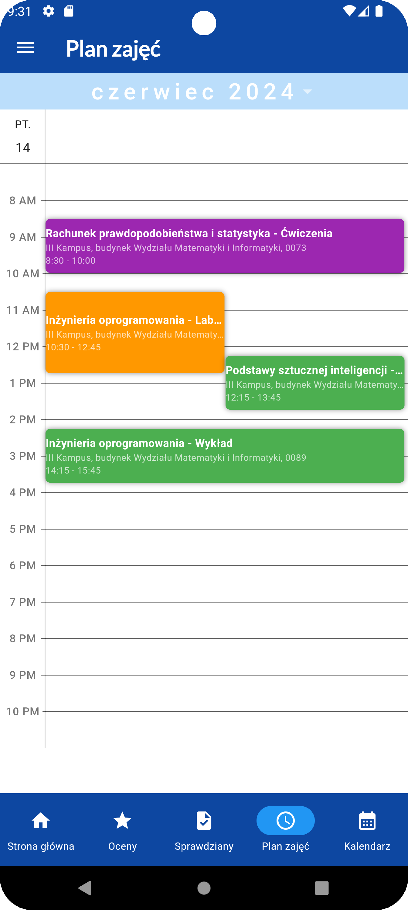
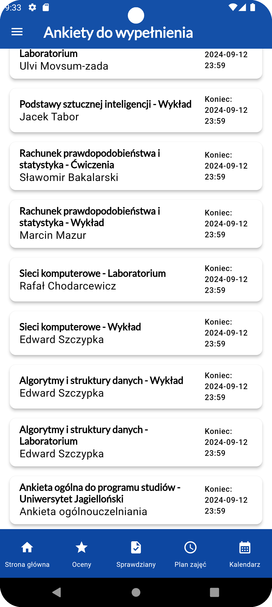
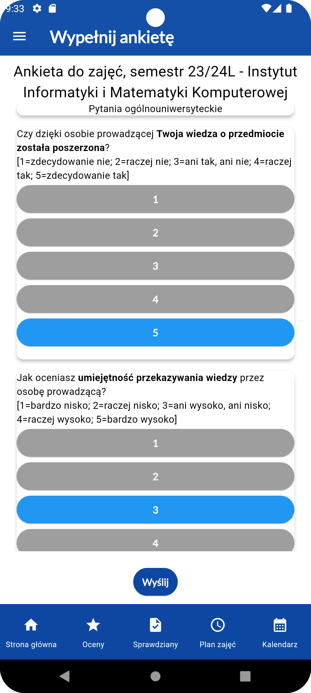
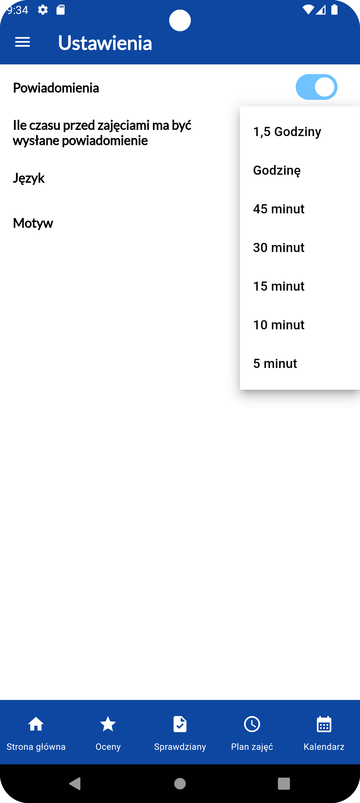
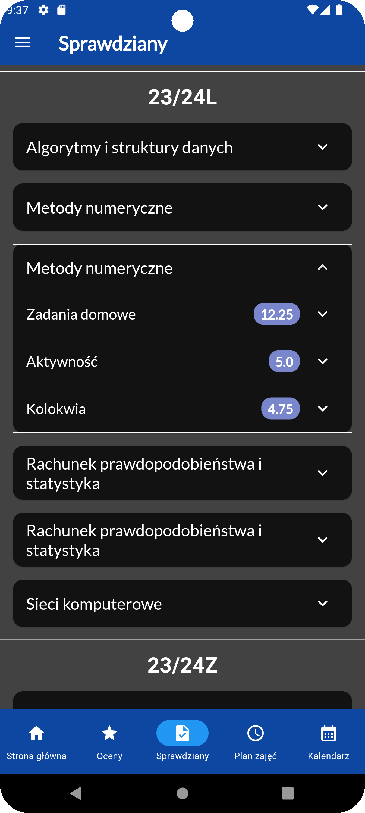
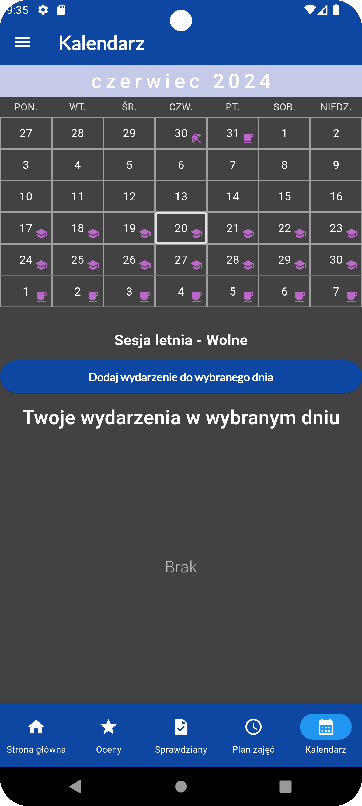
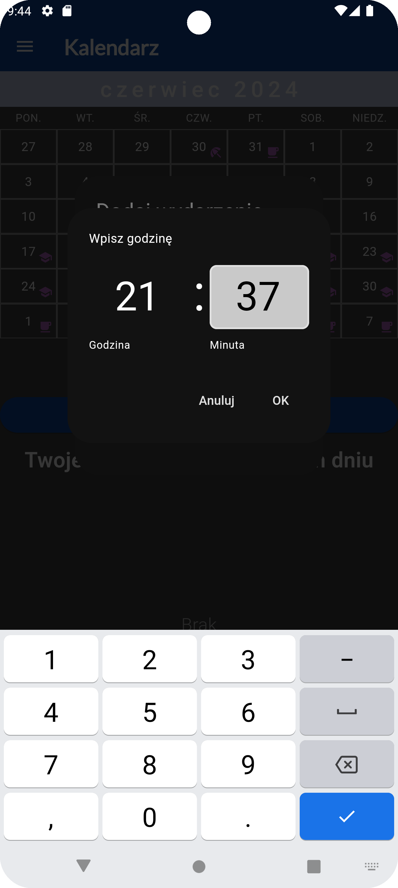

# OpenUSOS
## Authors: Oskar Kuliński, Filip Ciebiera, Wieńczysław Włodyga   
### Current version: 1.1.0

Or download the latest APK from the [Releases Section](https://github.com/OpenUSOS/OpenUSOS/releases/latest).

### An open source unofficial USOS app, for students in Poland.
Here you can
<ul>
<li>set and receive notifications about upcoming classes</li>
<li>view your grades</li>
<li>view your test results</li>
<li>check your class schedule</li>
<li>see the academic year calendar and add your own events to it</li>
<li>fill out university surveys</li>
<li>send emails to university staff</li>
</ul>

Currently supported universities
<ul>
<li>Uniwersytet Jagielloński</li>
<li>Politechnika Wrocławska</li>
<li>Chrześcijańska Akademia Teologiczna w Warszawie.</li>
</ul>

We use our own server to communicate with the USOS system. You can view its code here:
https://github.com/OpenUSOS/OpenUSOS-server

Our plans for the future:
<ul>
<li>speed up the app</li>
<li>improve the look of emails - done</li>
<li>add viewing course groups</li>
<li>in app bug reporting</li>
<li>release on Google Play Store</li>
<li>add notifications about upcoming registrations</li>
<li>add registration for classe</li>
<li>start work on an IOS release</li>
</ul>

## Screenshots 
Some screenshots for you to admire the amazingness of our app

## Contributing
<ul>
<li>If you want to report a bug, you can do so by opening an issue here 
https://github.com/OpenUSOS/OpenUSOS/issues</li>  
<li>If you want to make some visual changes to the app you can edit 
*lib/pages/whatever_page_you_want_to_improve.dart*
The file names there should be pretty self explanatory, with every page having its own file </li>
<li>You can also modify the *lib/themes.dart* file, where our themes are stored</li>
<li>If you want to add a new feature all by yourself you need to add it both in the app, and the server</li>
<li>If you can/want to do it in only one place, let us know, we will do our best to help you out, 
and implement the feature on the other side</li>
<li>If you want to help us out financially, an option will be available soon</li>
</ul>

## Self hosting
The app uses our server to communicate with the USOS system. If you want additional security feel
free to host your own instance of the server. All you have to do is change the UserSession.host
to the address of your server in lib/user_session.dart and follow the steps in here:  
https://github.com/OpenUSOS/OpenUSOS-server/blob/main/README.md#self-hosting

## Making your own server
https://github.com/OpenUSOS/OpenUSOS-server/blob/main/README.md#making-your-own-server
